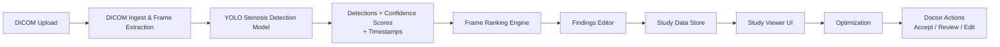
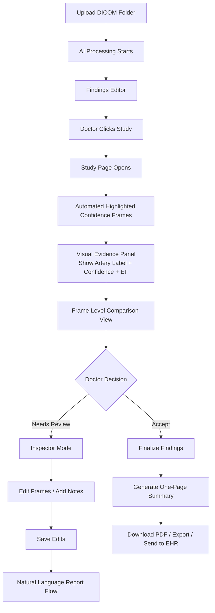
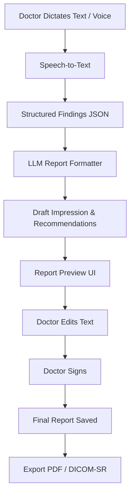
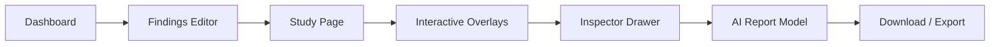

Original image:
```bash
+----------------------------+
|     heart + vessels        |
|        [stenosis]          |
|                            |
+----------------------------+
```
After ROI cropping:
```bash
+------------+
|  artery    |
|  stenosis  |
+------------+
```
How ROI Cropping fits in pipeline:

```bash
Angiography Image
        ↓
YOLOv8 (detect stenosis)
        ↓
ROI Cropping  ← YOU ARE HERE
        ↓
Lumen Segmentation (U-Net)
        ↓
Centerline + Diameter
        ↓
% Stenosis
```

```bash
Binary mask (yours)
   ↓
Mask cleanup  ← REQUIRED
   ↓
Single-vessel extraction
   ↓
Skeleton (centerline)
   ↓
Distance transform
   ↓
Diameter profile
   ↓
% stenosis
```

update pipeline
```bash 
ROI
 ↓
Binary lumen mask
 ↓
Skeleton + diameter
 ↓
YOLO stenosis window
 ↓
D_min  ← inside YOLO box
D_ref  ← outside YOLO box
 ↓
% stenosis
```
```bash
Original Image
   ↓
YOLOv8 (stenosis localization)
   ↓
ROI crop + save YOLO box metadata
   ↓
Lumen segmentation (automatic mask)
   ↓
Skeleton + diameter computation
   ↓
D_min ONLY inside YOLO box
D_ref ONLY outside YOLO box
   ↓
% stenosis
```
So for each ROI, store:
```bash
{
  "image": "roi_001.png",
  "roi_offset": [roi_x1, roi_y1],
  "yolo_box": [sx1, sy1, sx2, sy2]
}
```

```bash
Doctor Uploads Images
        ↓
YOLO Stenosis Detection (fast)
        ↓
┌───────────────┐
│ If stenosis   │── YES ──▶ Full pipeline
│ detected?     │           (ROI → Mask → Diameter)
└───────────────┘
        │
        NO
        │
  Skip image (store as normal)
```


Doctor's flow

Natural Language Report Flow

Application Flow:


